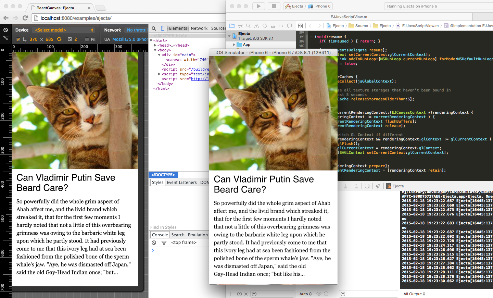

# React Canvas + Ejecta

This is a fork of [React Canvas](https://github.com/flipboard/react-canvas) that demonstrates the ability for React Canvas applications to run as fully native iOS applications using [Ejecta](http://impactjs.com/ejecta).



## Running the demo

From the root directory:

```
npm install
npm start
```

`npm start` will create JavaScript bundles for both the browser and the iOS app. A live reloading server will also start on port 8080.

To run the iOS app, open the Xcode project at `examples/ejecta/iOS/Ejecta.xcodeproj`.

To open the demo in the browser go to:
```
http://localhost:8080/examples/ejecta
```

Make sure to emulate a touch device. This is easiest with Chrome.

## Why?

React Canvas tries hard to stay on the fast path to the GPU. But the browser environment still has some limitations.

Most importantly, image decoding occurs on the main thread which impacts scrolling performance. Touch latency is also not on par with native gesture recognizers. The native shell also has control over when to run garbage collection in the JavaScript VM.

The downside to this approach is that Ejecta bundles JavaScriptCore which will increase the size of the binary. This will unfortunately be the case until the JavaScriptCore framework that ships with iOS [supports typed arrays](https://bugs.webkit.org/show_bug.cgi?id=120112).
